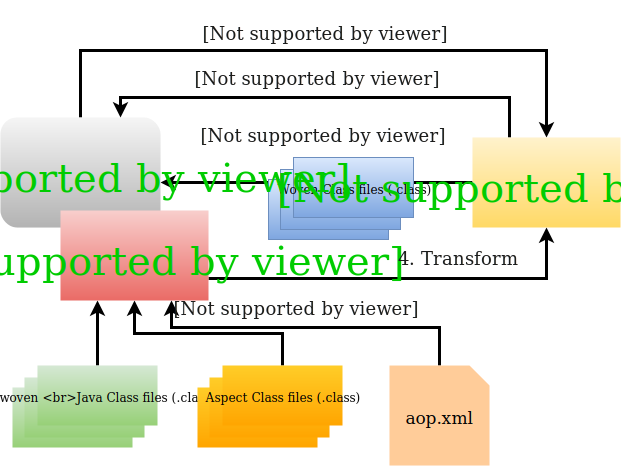

[![Build Status][travis-badge]][travis-badge-url]
[![Quality Gate][sonarqube-badge]][sonarqube-badge-url] 
[![Technical debt ratio][technical-debt-ratio-badge]][technical-debt-ratio-badge-url] 
[![Coverage][coverage-badge]][coverage-badge-url]


Spring Boot Load-Time Weaving Example with AspectJ
===============================================================
This is an example of Spring Boot load time weaving with AspectJ. It's the
continuation of the previous [Spring Boot source weaving example](https://github.com/indrabasak/spring-source-weaving-example).

### Load Time Weaving
The load-time weaving is a type of binary weaving where compiled Java classes
are taken as an input at runtime instead of compile time. The classes
are weaved as they are loaded by the Java Virtual Machine (JVM).

The load-time weaving process weaves classes with the help of Java Agent. A Java Agent 
intercepts the classes while they are being loaded by the JVM. The intercepted 
classes are instrumented (bytecode is modified) by the agent based on 
the AspectJ definitions contained in a meta file named `aop.xml`. The `aop.xml` 
file should be in the classpath in order to be picked up by the agent.



### When do you need load-time weaving?
THe load-time weaving is useful when aspects are required at certain times but not
all the times. For example, monitoring application performance or investigating
thread deadlocks, etc. This way you can keep your application source code free of
aspect related code.

```java
@Target({ElementType.METHOD})
@Retention(RetentionPolicy.RUNTIME)
public @interface CustomAnnotation {

    String description() default "";
}
```

1. A `CustomAnnotationAspect` aspect to intercept any method marked with
`@CustomAnnotation`. It prints out the name of the intercepted class and method.
**Note:** Unlike the previous [source weaving example](https://github.com/indrabasak/spring-source-weaving-example),
this `CustomAnnotationAspect` aspect do not have the Spring `@Component`
annotation since it's not going to be deployed as a bean.

```java
@Aspect
public class CustomAnnotationAspect {

    private static final Logger
            log = LoggerFactory.getLogger(CustomAnnotationAspect.class);

    @Before("@annotation(anno) && execution(* *(..))")
    public void inspectMethod(JoinPoint jp, CustomAnnotation anno) {
        log.info(
                "Entering CustomAnnotationAspect.inspectMethod() in class "
                        + jp.getSignature().getDeclaringTypeName()
                        + " - method: " + jp.getSignature().getName()
                        + " description: " + anno.description());
    }
}
```

1. The `BookService` class is the example where the `@CustomAnnotation` is used.
The **privat**e method `validateRequest` is called from `create` method. The
`create` method is annotated with Spring's `@Transactional` annotation.

```java
@Service
public class BookService {

    private static final Logger
            log = LoggerFactory.getLogger(BookService.class);
    
    private BookRepository repository;

    @Autowired
    public BookService(BookRepository repository) {
        this.repository = repository;
    }

    @Transactional
    public Book create(BookRequest request) {
        Book entity = validateRequest(request);
        return repository.save(entity);
    }

    public Book read(UUID id) {
        return repository.getOne(id);
    }

    @CustomAnnotation(description = "Validates book request.")
    private Book validateRequest(BookRequest request) {
        log.info("Validating book request!");

        Assert.notNull(request, "Book request cannot be empty!");
        Assert.notNull(request.getTitle(), "Book title cannot be missing!");
        Assert.notNull(request.getAuthor(), "Book author cannot be missing!");

        Book entity = new Book();
        entity.setTitle(request.getTitle());
        entity.setAuthor(request.getAuthor());

        return entity;
    }
}
```

### Aspect Filter Examples
This example also includes couple of examples on how to apply aspect conditionally
based on either the called method's annotation or by name.

1. Filter by caller's method tagged with a certain type of annotation,

```java
@Aspect
public class FilterCallerAnnotationAspect {

    private static final Logger
            log = LoggerFactory.getLogger(FilterCallerAnnotationAspect.class);

    @Before("call(* com.basaki.service.UselessService.sayHello(..))" +
            "  && cflow(@annotation(trx))")
    public void inspectMethod(JoinPoint jp,
            JoinPoint.EnclosingStaticPart esjp, Transactional trx) {
        log.info(
                "Entering FilterCallerAnnotationAspect.inspectMethod() in class "
                        + jp.getSignature().getDeclaringTypeName()
                        + " - method: " + jp.getSignature().getName());
    }
}
```

This aspect will only be applied when the `service` method of `UselessService`
class is called from methods annotated with Spring's `Transactional` annotation.

1. Filter by caller's method's name,

```java
@Aspect
public class FilterCallerMethodAspect {

    private static final Logger
            log = LoggerFactory.getLogger(FilterCallerMethodAspect.class);

    @Before("call(* com.basaki.service.UselessService.sayHello(..))" +
            "  && cflow(execution(* com.basaki.service.BookService.read(..)))")
    public void inspectMethod(JoinPoint jp,
            JoinPoint.EnclosingStaticPart esjp) {
        log.info(
                "Entering FilterCallerMethodAspect.inspectMethod() in class "
                        + jp.getSignature().getDeclaringTypeName()
                        + " - method: " + jp.getSignature().getName());
    }
}
```

This aspect will only be applied when the `service` method of `UselessService`
class is called from `read` method of `BookService`.

### Dependency Requirements

#### AspectJ Runtime Library
Annotation such as `@Aspect`, `@Pointcut`, and `@Before` are in `aspectjrt.jar`.
The `aspectjrt.jar` and must be in the classpath regardless of whether 
the aspects in the code are compiled with `ajc` or `javac`.

```xml
<dependency>
    <groupId>org.aspectj</groupId>
    <artifactId>aspectjrt</artifactId>
    <version>1.8.13</version>
</dependency>
```

#### AspectJ Weaving Library
The `aspectjweaver.jar` contains the AspectJ wevaing classes. The weaver is 
responsible for mapping crosscutting elements to Java constructs.

```xml
<dependency>
    <groupId>org.aspectj</groupId>
    <artifactId>aspectjweaver</artifactId>
    <version>1.8.13</version>
</dependency>
```

#### AspectJ Weaver Configuration

The load-time waving is configured using a file named `aop.xml`. The `aop.xml`
is made available to the classpath by placing it in the `META-INF` directory
under the `resources` folder.

The `aop.xml` contains the following sections:

1. **Aspect** section defines all the aspects that are to be used 
in the weaving process. In our example, there is only one aspect, i.e.,
`CustomAnnotationAspect`.

2. **Weaver** section defines all the classes (e.g., `com.basaki.service.*`) 
that are to be woven. 

It should also include the packages where the aspects are defined
 (e.g., `com.basaki.aspect.*`).
 
It also specifies other weaving options, e.g., `verbose`, `showWeaveInfo`, etc.

```xml
<aspectj>
    <aspects>
        <aspect name="com.basaki.aspect.CustomAnnotationAspect"/>
        <weaver options="-verbose -showWeaveInfo">
            <include within="com.basaki.service.*"/>
            <include within="com.basaki.aspect.*"/>
        </weaver>
    </aspects>
</aspectj>
```

#### AspectJ Maven Plugin
The `maven-surefire-plugin` plugin is only needed if you run the Spring Boot
application from an IDE (e.g., IntelliJ). It's required to add the 
`-javaagent` JVM arguments.

```xml
<plugin>
   <groupId>org.apache.maven.plugins</groupId>
   <artifactId>maven-surefire-plugin</artifactId>
   <version>2.20.1</version>
   <configuration>
      <argLine>-javaagent:"${settings.localRepository}"/org/aspectj/
                        aspectjweaver/1.8.13/
                        aspectjweaver-1.8.13.jar</argLine>
      <useSystemClassLoader>true</useSystemClassLoader>
      <forkMode>always</forkMode>
   </configuration>
</plugin>
```

### Build
To build the JAR, execute the following command from the parent directory:

```
mvn clean install
```

### Run
You need to use the `-javaagent:` JVM argument whenever you run the 
executable Spring Boot jar. 

Here is the command to run the application:
```
java -javaagent:lib/aspectjweaver-1.8.13.jar -jar spring-loadtime-weaving-example-1.0.0.jar
```
In the example shown below, it's expected that the `aspectjweaver.jar` 
is located in the `lib` directory.

### Usage
Once the application starts up at port `8080`, you can access the swagger UI at 
`http://localhost:8080/swagger-ui.html`. From the UI, you can create and retrieve
book entities.

Once you create a book entity, you should notice the following message on the
terminal:

```
2018-02-09 17:11:38.022  INFO 51061 --- [nio-8080-exec-1] o.s.web.servlet.DispatcherServlet        : FrameworkServlet 'dispatcherServlet': initialization completed in 25 ms
2018-02-09 17:11:38.193  INFO 51061 --- [nio-8080-exec-1] c.basaki.aspect.CustomAnnotationAspect   : Entering CustomAnnotationAspect.inspectMethod() in class com.basaki.service.BookService - method: validateRequest description: Validates book request.
2018-02-09 17:11:38.194  INFO 51061 --- [nio-8080-exec-1] com.basaki.service.BookService           : Validating book request!
```

[travis-badge]: https://travis-ci.org/indrabasak/spring-loadtime-weaving-example.svg?branch=master
[travis-badge-url]: https://travis-ci.org/indrabasak/spring-loadtime-weaving-example/

[sonarqube-badge]: https://sonarcloud.io/api/project_badges/measure?project=com.basaki%3Aspring-loadtime-weaving-example&metric=alert_status
[sonarqube-badge-url]: https://sonarcloud.io/dashboard/index/com.basaki:spring-loadtime-weaving-example 

[technical-debt-ratio-badge]: https://sonarcloud.io/api/project_badges/measure?project=com.basaki%3Aspring-loadtime-weaving-example&metric=sqale_index
[technical-debt-ratio-badge-url]: https://sonarcloud.io/dashboard/index/com.basaki:spring-loadtime-weaving-example 

[coverage-badge]: https://sonarcloud.io/api/project_badges/measure?project=com.basaki%3Aspring-loadtime-weaving-example&metric=coverage
[coverage-badge-url]: https://sonarcloud.io/dashboard/index/com.basaki:spring-loadtime-weaving-example
